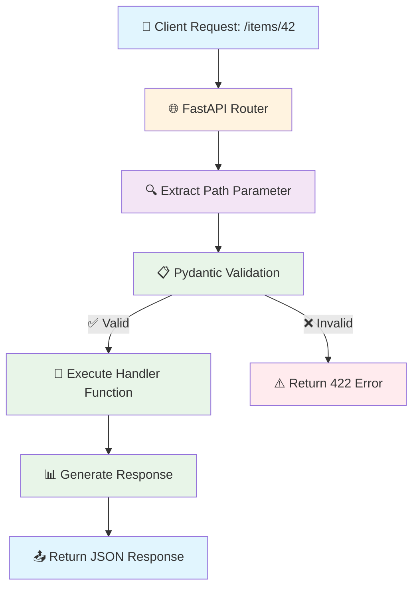
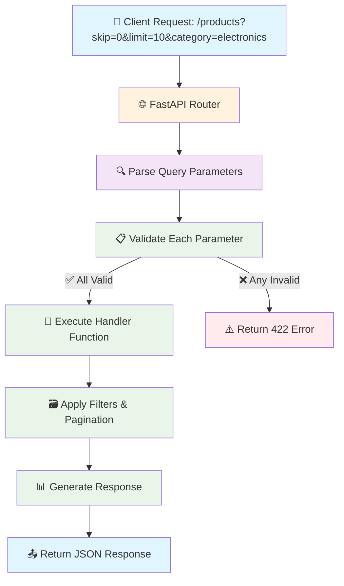
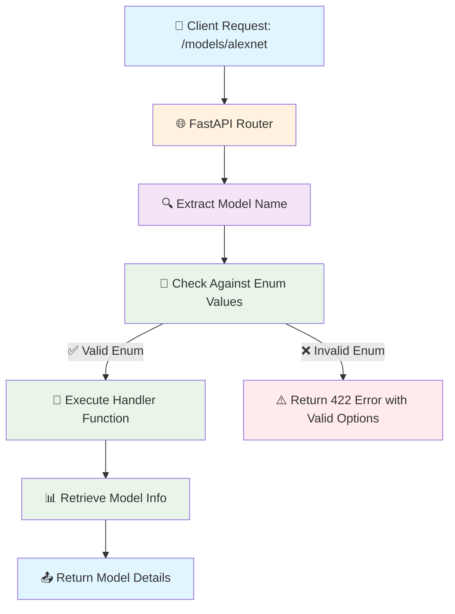

# 🚀 Complete FastAPI Setup & GET Methods Guide

## 🎯 Overview

This comprehensive guide covers everything from setting up a FastAPI project to implementing sophisticated GET methods with path parameters, query parameters, and validation. Whether you're a beginner or looking to enhance your FastAPI skills, this guide provides detailed explanations, code examples, and best practices.

## 🛠️ **Part 1: Environment Setup & Project Structure**

### 🧪 **1. Virtual Environment Setup (Cross-Platform)**

```bash
# 📦 Install virtualenv (if not already installed)
pip install virtualenv

# 🏗️ Create virtual environment
virtualenv venv

# ⚡ Activate virtual environment
# Windows 🪟
venv\Scripts\activate

# macOS/Linux 🐧🍎
source venv/bin/activate

# ✅ Verify activation (should show (venv) in prompt)
which python  # Should point to venv/bin/python
```

**💡 Pro Tips:**
- Always use virtual environments to avoid dependency conflicts
- Use descriptive names for project-specific environments
- Consider using `python -m venv venv` as an alternative to virtualenv

### 📦 **2. Install Core Dependencies**

```bash
# 🚀 Install FastAPI and Uvicorn
pip install fastapi uvicorn

# 🔧 Additional useful packages
pip install python-multipart  # For file uploads
pip install python-dotenv     # For environment variables
pip install pydantic[email]    # Enhanced Pydantic validation

# 💾 Save dependencies for team collaboration
pip freeze > requirements.txt
```

### 📁 **3. Professional Project Structure**

```
fastapi_project/
│
├── 📄 main.py                 # Main application entry point
├── 📄 requirements.txt        # Project dependencies
├── 📁 app/                    # Application package
│   ├── 📄 __init__.py
│   ├── 📁 routers/           # Route modules
│   │   ├── 📄 __init__.py
│   │   ├── 📄 items.py
│   │   └── 📄 users.py
│   ├── 📁 models/            # Pydantic models
│   │   ├── 📄 __init__.py
│   │   └── 📄 item.py
│   ├── 📁 core/              # Core functionality
│   │   ├── 📄 __init__.py
│   │   └── 📄 config.py
│   └── 📁 utils/             # Utility functions
│       ├── 📄 __init__.py
│       └── 📄 helpers.py
├── 📁 tests/                 # Test modules
│   ├── 📄 __init__.py
│   └── 📄 test_main.py
├── 📁 static/                # Static files
├── 📁 templates/             # HTML templates (if needed)
└── 📁 venv/                  # Virtual environment
```

## 🎯 **Part 2: Core FastAPI Implementation**

### 🔧 **4. Main Application with Advanced Configuration**

```python
# main.py
from fastapi import FastAPI, Query, Path, HTTPException, status
from fastapi.middleware.cors import CORSMiddleware
from fastapi.responses import JSONResponse
from typing import Optional, List
from enum import Enum
import uvicorn

# 🎨 Create FastAPI instance with metadata
app = FastAPI(
    title="📚 Advanced FastAPI Guide",
    description="🚀 Comprehensive FastAPI implementation with best practices",
    version="1.0.0",
    contact={
        "name": "Your Name",
        "email": "your.email@example.com",
    },
    license_info={
        "name": "MIT",
        "url": "https://opensource.org/licenses/MIT",
    },
)

# 🌐 Add CORS middleware for frontend integration
app.add_middleware(
    CORSMiddleware,
    allow_origins=["*"],  # Configure appropriately for production
    allow_credentials=True,
    allow_methods=["*"],
    allow_headers=["*"],
)

# 🔧 Predefined values using Enum for type safety
class ModelName(str, Enum):
    """🤖 Machine Learning model names with descriptions"""
    alexnet = "alexnet"    # Image classification
    resnet = "resnet"      # Residual networks
    lenet = "lenet"        # Classic CNN architecture
    transformer = "transformer"  # Attention-based models

class Category(str, Enum):
    """📦 Product categories for filtering"""
    electronics = "electronics"
    clothing = "clothing"
    books = "books"
    home_garden = "home_garden"
    sports = "sports"

# 🏠 Root endpoint with API information
@app.get("/", tags=["🏠 Home"])
async def root():
    """
    🎯 API Welcome endpoint
    
    Returns:
        dict: Welcome message and API information
    """
    return {
        "message": "🚀 Welcome to Advanced FastAPI Guide!",
        "version": "1.0.0",
        "docs_url": "/docs",
        "redoc_url": "/redoc",
        "features": [
            "📍 Path Parameters with validation",
            "🔍 Query Parameters with constraints", 
            "🎯 Predefined values with Enums",
            "📊 Automatic API documentation",
            "🛡️ Built-in data validation"
        ]
    }

# 🆔 Basic path parameter with type validation
@app.get("/items/{item_id}", tags=["📦 Items"])
async def read_item(
    item_id: int = Path(
        ..., 
        title="Item ID",
        description="🆔 Unique identifier for the item",
        ge=1,  # Greater than or equal to 1
        le=1000  # Less than or equal to 1000
    )
):
    """
    📦 Retrieve item by ID with validation
    
    Args:
        item_id (int): Item identifier (1-1000)
        
    Returns:
        dict: Item information with metadata
        
    Raises:
        HTTPException: If item_id is out of range (handled by Pydantic)
    """
    
    # 🎲 Simulate item data (replace with database query)
    mock_item = {
        "item_id": item_id,
        "name": f"📱 Item {item_id}",
        "description": f"🔍 This is item number {item_id}",
        "price": item_id * 10.99,
        "in_stock": item_id % 2 == 0,  # Even IDs are in stock
        "created_at": "2024-01-01T00:00:00Z"
    }
    
    return {
        "status": "✅ success",
        "data": mock_item,
        "meta": {
            "request_id": f"req_{item_id}",
            "api_version": "1.0.0"
        }
    }

# 🤖 Path parameter with predefined values (Enum)
@app.get("/models/{model_name}", tags=["🤖 AI Models"])
async def get_model(model_name: ModelName):
    """
    🤖 Get information about AI/ML models
    
    Args:
        model_name (ModelName): Predefined model name from enum
        
    Returns:
        dict: Model information and characteristics
    """
    
    # 📊 Model metadata database
    model_info = {
        ModelName.alexnet: {
            "description": "🖼️ Deep convolutional neural network for image classification",
            "year": 2012,
            "parameters": "60M",
            "accuracy": "84.7%",
            "use_cases": ["Image Recognition", "Computer Vision"]
        },
        ModelName.resnet: {
            "description": "🔗 Residual networks with skip connections",
            "year": 2015,
            "parameters": "25.6M",
            "accuracy": "92.9%",
            "use_cases": ["Image Classification", "Object Detection"]
        },
        ModelName.lenet: {
            "description": "🏛️ Classic CNN architecture for digit recognition",
            "year": 1989,
            "parameters": "431K",
            "accuracy": "98.8%",
            "use_cases": ["Digit Recognition", "Simple Classification"]
        },
        ModelName.transformer: {
            "description": "🎯 Attention-based model for sequence tasks",
            "year": 2017,
            "parameters": "110M",
            "accuracy": "95.2%",
            "use_cases": ["NLP", "Machine Translation", "Text Generation"]
        }
    }
    
    return {
        "model_name": model_name,
        "info": model_info[model_name],
        "status": "✅ Model information retrieved successfully"
    }

# 🔍 Advanced query parameters with validation
@app.get("/products/", tags=["🛍️ Products"])
async def get_products(
    # 📄 Pagination parameters
    skip: int = Query(
        0, 
        ge=0, 
        title="Skip Items",
        description="📊 Number of items to skip for pagination"
    ),
    limit: int = Query(
        10, 
        ge=1, 
        le=100, 
        title="Limit Results",
        description="🔢 Maximum number of items to return (1-100)"
    ),
    
    # 🔍 Search and filter parameters
    search: Optional[str] = Query(
        None,
        min_length=2,
        max_length=50,
        title="Search Query",
        description="🔍 Search term for product names or descriptions"
    ),
    
    category: Optional[Category] = Query(
        None,
        title="Product Category",
        description="📦 Filter products by category"
    ),
    
    # 💰 Price filtering
    min_price: Optional[float] = Query(
        None,
        ge=0,
        title="Minimum Price",
        description="💰 Minimum price filter"
    ),
    max_price: Optional[float] = Query(
        None,
        ge=0,
        title="Maximum Price", 
        description="💰 Maximum price filter"
    ),
    
    # 📦 Stock filtering
    in_stock_only: bool = Query(
        False,
        title="In Stock Only",
        description="📦 Show only products that are in stock"
    ),
    
    # 📊 Sorting
    sort_by: Optional[str] = Query(
        "name",
        regex="^(name|price|created_at)$",
        title="Sort Field",
        description="📊 Sort products by field (name, price, created_at)"
    ),
    
    sort_order: Optional[str] = Query(
        "asc",
        regex="^(asc|desc)$", 
        title="Sort Order",
        description="📈 Sort order: asc (ascending) or desc (descending)"
    )
):
    """
    🛍️ Advanced product search with filtering, pagination, and sorting
    
    This endpoint demonstrates comprehensive query parameter usage including:
    - 📄 Pagination (skip, limit)
    - 🔍 Text search
    - 📦 Category filtering  
    - 💰 Price range filtering
    - 📦 Stock availability filtering
    - 📊 Flexible sorting options
    
    Returns:
        dict: Filtered and paginated product results with metadata
    """
    
    # 🎲 Mock product database (replace with real database queries)
    mock_products = [
        {"id": 1, "name": "📱 iPhone 15", "category": "electronics", "price": 999.99, "in_stock": True},
        {"id": 2, "name": "👕 Cotton T-Shirt", "category": "clothing", "price": 29.99, "in_stock": True},
        {"id": 3, "name": "📚 Python Programming", "category": "books", "price": 49.99, "in_stock": False},
        {"id": 4, "name": "🏠 Garden Hose", "category": "home_garden", "price": 39.99, "in_stock": True},
        {"id": 5, "name": "⚽ Soccer Ball", "category": "sports", "price": 24.99, "in_stock": True},
    ]
    
    # 🔍 Apply filters (in real app, this would be database queries)
    filtered_products = mock_products
    
    # Category filter
    if category:
        filtered_products = [p for p in filtered_products if p["category"] == category]
    
    # Price filters
    if min_price is not None:
        filtered_products = [p for p in filtered_products if p["price"] >= min_price]
    if max_price is not None:
        filtered_products = [p for p in filtered_products if p["price"]  0
            },
            "filters_applied": {
                "search": search,
                "category": category,
                "min_price": min_price,
                "max_price": max_price,
                "in_stock_only": in_stock_only,
                "sort_by": sort_by,
                "sort_order": sort_order
            }
        },
        "meta": {
            "api_version": "1.0.0",
            "response_time": "45ms"
        }
    }

# 🆔 Multiple path parameters with validation
@app.get("/users/{user_id}/orders/{order_id}", tags=["👤 Users"])
async def get_user_order(
    user_id: int = Path(..., ge=1, title="User ID", description="🆔 User identifier"),
    order_id: int = Path(..., ge=1, title="Order ID", description="🛒 Order identifier"),
    include_items: bool = Query(False, title="Include Items", description="📦 Include order items in response")
):
    """
    👤 Get specific order for a user
    
    Args:
        user_id (int): User identifier
        order_id (int): Order identifier  
        include_items (bool): Whether to include order items
        
    Returns:
        dict: Order details with optional items
    """
    
    # 🎲 Mock order data
    order_data = {
        "order_id": order_id,
        "user_id": user_id,
        "status": "✅ completed",
        "total": 159.97,
        "created_at": "2024-01-15T10:30:00Z"
    }
    
    if include_items:
        order_data["items"] = [
            {"product_id": 1, "name": "📱 iPhone Case", "quantity": 2, "price": 24.99},
            {"product_id": 2, "name": "🔌 USB Cable", "quantity": 1, "price": 19.99},
            {"product_id": 3, "name": "🎧 Wireless Headphones", "quantity": 1, "price": 89.99}
        ]
    
    return {
        "status": "✅ success",
        "data": order_data
    }

# 🚀 Server startup event
@app.on_event("startup")
async def startup_event():
    """🚀 Application startup tasks"""
    print("🚀 FastAPI application starting up...")
    print("📚 API Documentation: http://localhost:8000/docs")
    print("📋 ReDoc Documentation: http://localhost:8000/redoc")

# 🛑 Server shutdown event  
@app.on_event("shutdown")
async def shutdown_event():
    """🛑 Application shutdown tasks"""
    print("🛑 FastAPI application shutting down...")

# 🚀 Run the application
if __name__ == "__main__":
    uvicorn.run(
        "main:app",
        host="0.0.0.0",
        port=8000,
        reload=True,  # Enable auto-reload during development
        log_level="info"
    )
```

## ▶️ **5. Running the Server**

```bash
# 🚀 Start development server with auto-reload
uvicorn main:app --reload

# 🌐 Start server on specific host and port
uvicorn main:app --host 0.0.0.0 --port 8000 --reload

# 🔧 Start with custom configuration
uvicorn main:app --reload --log-level debug --access-log

# 📊 Production server (without reload)
uvicorn main:app --host 0.0.0.0 --port 8000 --workers 4
```

**🔗 Access Points:**
- 🏠 **Main App**: http://127.0.0.1:8000
- 📚 **Swagger UI**: http://127.0.0.1:8000/docs  
- 📋 **ReDoc**: http://127.0.0.1:8000/redoc
- 📊 **OpenAPI Schema**: http://127.0.0.1:8000/openapi.json

## 🔄 **6. Request Flow Diagrams**

### 📍 **Path Parameter Flow**



### 🔍 **Query Parameter Flow**



### 🎯 **Enum Validation Flow**



## 🧪 **7. Testing Your API**

### 🔧 **Manual Testing Examples**

```bash
# 🆔 Test basic path parameter
curl "http://localhost:8000/items/42"

# 🤖 Test enum path parameter
curl "http://localhost:8000/models/alexnet"

# 🔍 Test query parameters
curl "http://localhost:8000/products/?skip=0&limit=5&category=electronics&in_stock_only=true"

# 🛒 Test multiple path parameters
curl "http://localhost:8000/users/123/orders/456?include_items=true"
```

### 🧪 **Automated Testing with pytest**

```python
# tests/test_main.py
import pytest
from fastapi.testclient import TestClient
from main import app

client = TestClient(app)

def test_read_root():
    """🏠 Test root endpoint"""
    response = client.get("/")
    assert response.status_code == 200
    data = response.json()
    assert "🚀 Welcome to Advanced FastAPI Guide!" in data["message"]

def test_read_item_valid():
    """📦 Test valid item ID"""
    response = client.get("/items/42")
    assert response.status_code == 200
    data = response.json()
    assert data["data"]["item_id"] == 42

def test_read_item_invalid():
    """⚠️ Test invalid item ID"""
    response = client.get("/items/-1")
    assert response.status_code == 422

def test_get_model_valid():
    """🤖 Test valid model name"""
    response = client.get("/models/alexnet")
    assert response.status_code == 200
    data = response.json()
    assert data["model_name"] == "alexnet"

def test_get_model_invalid():
    """⚠️ Test invalid model name"""
    response = client.get("/models/invalid_model")
    assert response.status_code == 422

def test_get_products_with_filters():
    """🔍 Test product filtering"""
    response = client.get("/products/?category=electronics&min_price=100&in_stock_only=true")
    assert response.status_code == 200
    data = response.json()
    assert "products" in data["data"]
    assert "pagination" in data["data"]

# 🚀 Run tests with: pytest tests/test_main.py -v
```

## 📊 **8. Complete Feature Comparison**

| Feature | Path Parameters | Enum Parameters | Query Parameters |
|---------|----------------|-----------------|------------------|
| **📍 Location** | URL path (`/items/{id}`) | URL path (`/models/{name}`) | URL query (`?skip=0&limit=10`) |
| **✅ Required** | Always required | Always required | Optional by default |
| **🔧 Validation** | Type hints + Path() | Enum class validation | Type hints + Query() |
| **📚 Documentation** | Auto-generated in OpenAPI | Dropdown with valid options | Form fields with constraints |
| **🎯 Use Cases** | Resource identifiers | Predefined choices | Filtering, pagination, search |
| **🛡️ Security** | Path traversal protection | Limited to enum values | Input sanitization |
| **⚡ Performance** | Fast (URL parsing) | Fast (enum lookup) | Moderate (query parsing) |

## 💡 **9. Best Practices & Pro Tips**

### 🛡️ **Security Considerations**

```python
from fastapi import HTTPException, status
import re

@app.get("/secure-items/{item_id}")
async def secure_read_item(
    item_id: int = Path(..., ge=1, le=999999),
    api_key: str = Query(..., min_length=32, max_length=32)
):
    """🛡️ Secure endpoint with validation"""
    
    # 🔑 Validate API key format
    if not re.match(r'^[a-zA-Z0-9]{32}$', api_key):
        raise HTTPException(
            status_code=status.HTTP_401_UNAUTHORIZED,
            detail="Invalid API key format"
        )
    
    # 🔍 Additional security checks
    if item_id in [666, 999]:  # Blocked IDs
        raise HTTPException(
            status_code=status.HTTP_403_FORBIDDEN,
            detail="Access to this item is restricted"
        )
    
    return {"item_id": item_id, "status": "✅ secure access granted"}
```

### ⚡ **Performance Optimization**

```python
from functools import lru_cache
from typing import Dict, Any

@lru_cache(maxsize=100)
def get_cached_model_info(model_name: str) -> Dict[str, Any]:
    """💾 Cache model information for better performance"""
    # Expensive database/API call simulation
    return {"model": model_name, "cached": True}

@app.get("/cached-models/{model_name}")
async def get_cached_model(model_name: ModelName):
    """⚡ Fast endpoint with caching"""
    return get_cached_model_info(model_name.value)
```

### 📊 **Response Standardization**

```python
from typing import Generic, TypeVar, Optional
from pydantic import BaseModel

T = TypeVar('T')

class APIResponse(BaseModel, Generic[T]):
    """📋 Standardized API response format"""
    status: str
    message: Optional[str] = None
    data: Optional[T] = None
    meta: Optional[Dict[str, Any]] = None

@app.get("/standardized-items/{item_id}", response_model=APIResponse[Dict])
async def standardized_read_item(item_id: int):
    """📊 Endpoint with standardized response"""
    return APIResponse(
        status="success",
        message="Item retrieved successfully",
        data={"item_id": item_id, "name": f"Item {item_id}"},
        meta={"api_version": "1.0.0", "timestamp": "2024-01-01T00:00:00Z"}
    )
```

## 🎯 **10. Summary & Next Steps**

### 🧠 **Key Takeaways**

- **🔧 Setup**: Virtual environments isolate dependencies and prevent conflicts
- **📍 Path Parameters**: Required, validated, perfect for resource identifiers  
- **🎯 Enums**: Restrict values to predefined options with automatic validation
- **🔍 Query Parameters**: Optional, great for filtering and pagination
- **📚 Documentation**: FastAPI automatically generates interactive docs
- **🛡️ Validation**: Pydantic handles all validation behind the scenes

### 🚀 **What's Next?**

1. **📝 POST/PUT Methods**: Learn request body handling with Pydantic models
2. **🔐 Authentication**: Implement OAuth2 and JWT security
3. **🗃️ Database Integration**: Connect with SQLAlchemy and async databases
4. **🧪 Advanced Testing**: Comprehensive test suites with fixtures
5. **🐳 Deployment**: Docker containerization and cloud deployment
6. **📊 Monitoring**: Logging, metrics, and health checks

### 📚 **Additional Resources**

- **📖 Official Docs**: [FastAPI Documentation](https://fastapi.tiangolo.com/)
- **🎯 Pydantic Guide**: [Pydantic Documentation](https://pydantic-docs.helpmanual.io/)
- **🧪 Testing Guide**: [FastAPI Testing](https://fastapi.tiangolo.com/tutorial/testing/)
- **🚀 Deployment**: [FastAPI Deployment](https://fastapi.tiangolo.com/deployment/)

