# 📁 FastAPI File Handling 

## 🚀 Overview

FastAPI provides powerful and flexible file handling capabilities that allow developers to upload, download, and serve files efficiently. This documentation covers all aspects of file management with detailed code explanations, flow diagrams, and best practices.

## 📤 1. Uploading Files in FastAPI

FastAPI offers **two primary approaches** for handling file uploads, each suited for different use cases:

### ✅ **Option 1: Using `bytes`**

```python
from fastapi import FastAPI, File
from typing import List

app = FastAPI()

@app.post("/upload-bytes/")
def upload_bytes(file: bytes = File(...)):
    """
    📝 Handle file upload using bytes
    
    Args:
        file (bytes): Raw file content as bytes object
        
    Returns:
        dict: Processed file content split into lines
    """
    try:
        # 🔄 Decode bytes to UTF-8 string
        content = file.decode('utf-8')
        
        # ✂️ Split content into individual lines
        lines = content.split('\n')
        
        # 📊 Return processed data
        return {
            "status": "success",
            "total_lines": len(lines),
            "lines": lines,
            "file_size_bytes": len(file)
        }
    except UnicodeDecodeError:
        # ⚠️ Handle encoding errors gracefully
        return {
            "status": "error",
            "message": "File encoding not supported. Please upload UTF-8 encoded files."
        }
```


#### 🔍 **Characteristics of `bytes` approach:**

- 🧠 **Memory Storage**: Entire file loaded into RAM
- ⚡ **Performance**: Fast for small files (< 1MB)
- 🎯 **Use Cases**: Configuration files, small CSVs, JSON files
- ⚠️ **Limitations**: Can cause memory overflow with large files
- 📊 **File Object**: Raw `bytes` object (not a file-like object)


### ✅ **Option 2: Using `UploadFile`**

```python
from fastapi import FastAPI, UploadFile, File, HTTPException
import aiofiles
import os
from typing import Dict, Any

app = FastAPI()

@app.post("/upload-file/")
async def upload_file(upload_file: UploadFile = File(...)) -> Dict[str, Any]:
    """
    📁 Handle file upload using UploadFile object
    
    Args:
        upload_file (UploadFile): File-like object with metadata
        
    Returns:
        dict: Comprehensive file information and processed content
    """
    # ✅ Validate file type
    allowed_types = ['text/plain', 'text/csv', 'application/json']
    if upload_file.content_type not in allowed_types:
        raise HTTPException(
            status_code=400, 
            detail=f"File type {upload_file.content_type} not supported. Allowed: {allowed_types}"
        )
    
    try:
        # 📖 Read file content asynchronously
        content = await upload_file.read()
        
        # 🔄 Decode and process content
        text_content = content.decode('utf-8')
        lines = text_content.split('\n')
        
        # 📊 Generate comprehensive response
        return {
            "status": "success",
            "file_info": {
                "filename": upload_file.filename,
                "content_type": upload_file.content_type,
                "size_bytes": len(content),
                "size_kb": round(len(content) / 1024, 2)
            },
            "content_analysis": {
                "total_lines": len(lines),
                "non_empty_lines": len([line for line in lines if line.strip()]),
                "first_few_lines": lines[:5] if lines else []
            }
        }
        
    except UnicodeDecodeError:
        raise HTTPException(
            status_code=400,
            detail="File encoding not supported. Please upload UTF-8 encoded files."
        )
    except Exception as e:
        raise HTTPException(
            status_code=500,
            detail=f"Error processing file: {str(e)}"
        )
    finally:
        # 🧹 Reset file pointer for potential reuse
        await upload_file.seek(0)
```


#### 🌟 **Benefits of `UploadFile`:**

- 💾 **Smart Storage**: Memory up to threshold, then temporary disk storage
- 📁 **File-like Methods**: `.read()`, `.write()`, `.seek()`, `.close()`
- 📋 **Rich Metadata**: Access to filename, content type, size
- 🔄 **Async Support**: Non-blocking file operations
- 🛡️ **Memory Efficient**: Suitable for large files


### 🎯 **Comparison Table: When to Use Which?**

| Criteria | `bytes` | `UploadFile` |
| :-- | :-- | :-- |
| **File Size** | < 1MB ✅ | Any size ✅ |
| **Memory Usage** | High ⚠️ | Optimized ✅ |
| **Metadata Access** | No ❌ | Yes ✅ |
| **File Operations** | Limited ❌ | Full support ✅ |
| **Async Support** | No ❌ | Yes ✅ |
| **Best For** | Config files | Media, documents |

## 💾 2. Save Uploaded File to Disk

```python
import aiofiles
import uuid
from pathlib import Path
from datetime import datetime

@app.post("/save-file/")
async def save_file(upload_file: UploadFile = File(...)):
    """
    💾 Save uploaded file to disk with enhanced error handling
    
    Args:
        upload_file (UploadFile): The file to be saved
        
    Returns:
        dict: Save operation result with file details
    """
    # 📁 Define upload directory
    upload_dir = Path("uploaded")
    upload_dir.mkdir(exist_ok=True)  # Create directory if it doesn't exist
    
    # 🔒 Generate unique filename to prevent conflicts
    file_extension = Path(upload_file.filename).suffix
    unique_filename = f"{uuid.uuid4()}{file_extension}"
    file_path = upload_dir / unique_filename
    
    try:
        # 📝 Save file using aiofiles for async I/O
        async with aiofiles.open(file_path, 'wb') as f:
            # 📖 Read file content
            content = await upload_file.read()
            # ✍️ Write content to disk
            await f.write(content)
        
        # 📊 Generate file statistics
        file_stats = file_path.stat()
        
        return {
            "status": "success",
            "message": f"File saved successfully",
            "file_details": {
                "original_filename": upload_file.filename,
                "saved_filename": unique_filename,
                "file_path": str(file_path),
                "size_bytes": file_stats.st_size,
                "saved_at": datetime.now().isoformat(),
                "content_type": upload_file.content_type
            }
        }
        
    except Exception as e:
        # 🧹 Clean up partial file if error occurs
        if file_path.exists():
            file_path.unlink()
            
        raise HTTPException(
            status_code=500,
            detail=f"Failed to save file: {str(e)}"
        )
```


## 🔒 3. Download File (Authentication Protected)

```python
from fastapi.responses import FileResponse
from fastapi import Depends, HTTPException, status
from auth.oauth import get_current_user  # Assuming OAuth implementation
import mimetypes

@app.get("/download/{file_name}")
async def download_file_protected(
    file_name: str, 
    current_user: dict = Depends(get_current_user)
):
    """
    🔒 Download file with authentication protection
    
    Args:
        file_name (str): Name of the file to download
        current_user (dict): Authenticated user information
        
    Returns:
        FileResponse: The requested file or error response
    """
    # 🛡️ Additional authorization check (optional)
    if not current_user.get("can_download_files", True):
        raise HTTPException(
            status_code=status.HTTP_403_FORBIDDEN,
            detail="User does not have permission to download files"
        )
    
    # 📁 Construct secure file path
    upload_dir = Path("uploaded")
    file_path = upload_dir / file_name
    
    # 🔍 Security check: Prevent path traversal attacks
    if not str(file_path.resolve()).startswith(str(upload_dir.resolve())):
        raise HTTPException(
            status_code=status.HTTP_400_BAD_REQUEST,
            detail="Invalid file path"
        )
    
    # ✅ Check file existence
    if not file_path.exists():
        raise HTTPException(
            status_code=status.HTTP_404_NOT_FOUND,
            detail=f"File '{file_name}' not found"
        )
    
    # 🎯 Determine appropriate MIME type
    content_type, _ = mimetypes.guess_type(str(file_path))
    if content_type is None:
        content_type = 'application/octet-stream'
    
    # 📊 Log download activity (optional)
    print(f"📥 User {current_user.get('username')} downloaded {file_name}")
    
    # 📤 Return file response
    return FileResponse(
        path=str(file_path),
        filename=file_name,
        media_type=content_type,
        headers={
            "Cache-Control": "no-cache",
            "X-Downloaded-By": current_user.get("username", "unknown")
        }
    )
```


## 🌐 4. Serve Static Files

```python
from fastapi.staticfiles import StaticFiles
from fastapi import HTTPException

# 📁 Mount static files directory
app.mount("/static", StaticFiles(directory="static"), name="static")

# 📊 Optional: Custom static file handler with logging
@app.get("/files/{file_path:path}")
async def serve_static_file(file_path: str):
    """
    🌐 Custom static file server with enhanced features
    
    Args:
        file_path (str): Relative path to the static file
        
    Returns:
        FileResponse: The requested static file
    """
    static_dir = Path("static")
    full_path = static_dir / file_path
    
    # 🔒 Security validation
    if not str(full_path.resolve()).startswith(str(static_dir.resolve())):
        raise HTTPException(status_code=400, detail="Invalid file path")
    
    if not full_path.exists():
        raise HTTPException(status_code=404, detail="File not found")
    
    # 📊 Log access (optional)
    print(f"🌐 Static file accessed: {file_path}")
    
    return FileResponse(full_path)
```

**📝 Static Files Configuration:**

- 📂 Place files in `static/` directory
- 🌐 Access via: `http://localhost:8000/static/filename.ext`
- ⚡ Automatically served by FastAPI
- 🎯 Perfect for: CSS, JS, images, documents


## 🔄 5. Flow Diagrams

### 📤 **File Upload Flow**

```mermaid
flowchart TD
    A[👤 Client] --> B[📤 POST /upload-file/]
    B --> C{📋 Validate File Type}
    C -->|✅ Valid| D[📖 Read File Content]
    C -->|❌ Invalid| E[⚠️ Return 400 Error]
    D --> F[🔄 Process Content]
    F --> G[📊 Generate Response]
    G --> H[📤 Return Results]
    
    style A fill:#e1f5fe
    style B fill:#fff3e0
    style C fill:#f3e5f5
    style D fill:#e8f5e8
    style F fill:#e8f5e8
    style G fill:#e8f5e8
    style H fill:#e1f5fe
    style E fill:#ffebee
```




### 💾 **Save to Disk Flow**


### 🔒 **Protected Download Flow**


## 🧪 Complete Testing Guide

### 🔧 **Setup Test Environment**

```python
import pytest
from fastapi.testclient import TestClient
from io import BytesIO

client = TestClient(app)

def test_upload_bytes():
    """🧪 Test bytes upload functionality"""
    test_content = "Hello\nWorld\nTest"
    response = client.post(
        "/upload-bytes/",
        files={"file": ("test.txt", test_content.encode(), "text/plain")}
    )
    assert response.status_code == 200
    data = response.json()
    assert data["status"] == "success"
    assert data["total_lines"] == 3

def test_upload_file():
    """🧪 Test UploadFile functionality"""
    test_content = "Line 1\nLine 2\nLine 3"
    response = client.post(
        "/upload-file/",
        files={"upload_file": ("test.txt", test_content.encode(), "text/plain")}
    )
    assert response.status_code == 200
    data = response.json()
    assert data["file_info"]["filename"] == "test.txt"
    assert data["content_analysis"]["total_lines"] == 3
```


### 📋 **Testing in Swagger UI**

1. **🚀 Start your FastAPI server**: `uvicorn main:app --reload`
2. **🌐 Open Swagger UI**: Navigate to `http://localhost:8000/docs`
3. **📤 Test Upload**:
    - Click on `/upload-file/` endpoint
    - Click "Try it out"
    - Select a small text file
    - Execute and review response
4. **🔐 Get Authentication Token**:
    - Use `/user/token` endpoint to login
    - Copy the access token from response
5. **🔒 Authorize Downloads**:
    - Click **Authorize** button in Swagger UI
    - Paste token in format: `Bearer your-token-here`
6. **📥 Test Download**: Use `/download/{file_name}` with saved file name

## 📊 Complete Feature Matrix

| Feature | Endpoint | Method | Auth Required | File Size Limit | Use Case |
| :-- | :-- | :-- | :-- | :-- | :-- |
| **Upload (Bytes)** | `/upload-bytes/` | POST | ❌ No | Small (< 1MB) | Config files 📄 |
| **Upload (File)** | `/upload-file/` | POST | ❌ No | Large (Any) | Documents 📁 |
| **Save to Disk** | `/save-file/` | POST | ❌ No | Large (Any) | File storage 💾 |
| **Protected Download** | `/download/{name}` | GET | ✅ Yes | Any | Secure access 🔒 |
| **Static Files** | `/static/{path}` | GET | ❌ No | Any | Public assets 🌐 |
| **Custom Static** | `/files/{path}` | GET | ❌ No | Any | Logged access 📊 |

## 💡 Real-World Implementation Examples

### 🖼️ **Profile Picture Upload**

```python
@app.post("/users/profile-picture/")
async def upload_profile_picture(
    file: UploadFile = File(...),
    current_user: dict = Depends(get_current_user)
):
    """🖼️ Upload and process user profile picture"""
    
    # ✅ Validate image file
    allowed_types = ['image/jpeg', 'image/png', 'image/webp']
    if file.content_type not in allowed_types:
        raise HTTPException(400, "Only JPEG, PNG, and WebP images allowed")
    
    # 📏 Check file size (max 5MB)
    content = await file.read()
    if len(content) > 5 * 1024 * 1024:
        raise HTTPException(400, "File size must be less than 5MB")
    
    # 💾 Save with user-specific naming
    filename = f"profile_{current_user['user_id']}.{file.filename.split('.')[-1]}"
    file_path = Path("static/profiles") / filename
    
    # Ensure directory exists
    file_path.parent.mkdir(parents=True, exist_ok=True)
    
    # Save file
    async with aiofiles.open(file_path, 'wb') as f:
        await f.write(content)
    
    return {
        "message": "Profile picture updated successfully",
        "image_url": f"/static/profiles/{filename}"
    }
```


### 📊 **CSV Data Processing**

```python
import pandas as pd
from io import StringIO

@app.post("/analyze-csv/")
async def analyze_csv(file: UploadFile = File(...)):
    """📊 Process and analyze CSV file"""
    
    if not file.filename.endswith('.csv'):
        raise HTTPException(400, "Only CSV files are allowed")
    
    try:
        # 📖 Read CSV content
        content = await file.read()
        csv_string = content.decode('utf-8')
        
        # 🐼 Create pandas DataFrame
        df = pd.read_csv(StringIO(csv_string))
        
        # 📊 Generate analysis
        analysis = {
            "rows": len(df),
            "columns": len(df.columns),
            "column_names": df.columns.tolist(),
            "data_types": df.dtypes.to_dict(),
            "missing_values": df.isnull().sum().to_dict(),
            "sample_data": df.head().to_dict('records')
        }
        
        return {"analysis": analysis}
        
    except Exception as e:
        raise HTTPException(500, f"CSV processing error: {str(e)}")
```


## 🛡️ Advanced Security Implementation

### 🔐 **File Type Validation**

```python
import magic

def validate_file_type(file_content: bytes, expected_types: list) -> bool:
    """🔍 Validate file type using magic numbers"""
    mime_type = magic.from_buffer(file_content, mime=True)
    return mime_type in expected_types

@app.post("/secure-upload/")
async def secure_upload(file: UploadFile = File(...)):
    """🛡️ Upload with comprehensive security checks"""
    
    # 📖 Read file content
    content = await file.read()
    
    # 🔍 Validate file type using magic numbers
    allowed_types = ['image/jpeg', 'image/png', 'text/plain']
    if not validate_file_type(content, allowed_types):
        raise HTTPException(400, "File type not allowed")
    
    # 🦠 Basic malware check (content scanning)
    suspicious_patterns = [b'<script', b'javascript:', b'<?php']
    for pattern in suspicious_patterns:
        if pattern in content:
            raise HTTPException(400, "Suspicious content detected")
    
    # 📏 Size validation
    max_size = 10 * 1024 * 1024  # 10MB
    if len(content) > max_size:
        raise HTTPException(400, "File too large")
    
    # ✅ File is safe to process
    return {"status": "File validated successfully"}
```


## 📚 Additional Resources \& References

### 🔗 **Official Documentation**

- [FastAPI File Uploads](https://fastapi.tiangolo.com/tutorial/request-files/)
- [FastAPI Static Files](https://fastapi.tiangolo.com/tutorial/static-files/)
- [FastAPI Security](https://fastapi.tiangolo.com/tutorial/security/)


### 📖 **Related Topics**

- [OAuth2 \& JWT Implementation](./9.%20OAuth.md)
- [Database Integration](./5.%20Database.md)
- [API Testing](./13.%20Complete%20FastAPI%20Production%20Guide%20Deployment,%20Debugging,%20Testing%20And%20Logging.md)


### 🛠️ **Required Dependencies**

```bash
# 📦 Core dependencies
pip install fastapi uvicorn python-multipart

# 🔒 Security & validation
pip install python-magic python-jose[cryptography]

# 📊 Data processing
pip install pandas aiofiles

# 🧪 Testing
pip install pytest httpx
```


## ⚡ Performance Optimization Tips

### 🚀 **Memory Management**

- Use `UploadFile` for files > 1MB
- Implement file streaming for very large files
- Set appropriate timeout values
- Use async file operations with `aiofiles`


### 📊 **Monitoring \& Logging**

```python
import logging
import time

logger = logging.getLogger(__name__)

@app.post("/upload-monitored/")
async def upload_with_monitoring(file: UploadFile = File(...)):
    """📊 File upload with performance monitoring"""
    start_time = time.time()
    
    try:
        # Process file
        content = await file.read()
        
        # Log metrics
        processing_time = time.time() - start_time
        logger.info(f"File processed: {file.filename}, Size: {len(content)}, Time: {processing_time:.2f}s")
        
        return {"status": "success", "processing_time": processing_time}
        
    except Exception as e:
        logger.error(f"File processing failed: {str(e)}")
        raise
```

---
