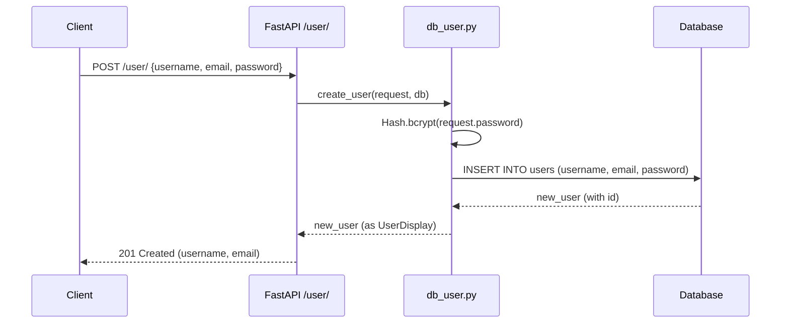

# 📝 FastAPI User Creation Flow Documentation

## 📁 Project Structure (Relevant Files)
```
.
├── main.py
├── routers/
│   └── user.py
├── db/
│   ├── database.py
│   ├── models.py
│   ├── db_user.py
│   └── hash.py
├── schemas.py
└── fastapi_practice.db
```

---

## 1. **Pydantic Schemas** (`schemas.py`)

These define the structure and validation for request and response data.

```python
from pydantic import BaseModel

# Request model: what the client sends
class UserBase(BaseModel):
    username: str
    email: str
    password: str

# Response model: what the API returns (no password for security)
class UserDisplay(BaseModel):
    username: str
    email: str
    class Config():
        orm_mode = True  # Allows compatibility with ORM objects
```

---

## 2. **Database Model** (`db/models.py`)

Defines the actual table structure in the database using SQLAlchemy.

```python
from sqlalchemy.sql.sqltypes import Integer, String
from db.database import Base
from sqlalchemy import Column

class DbUser(Base):
    __tablename__ = 'users'
    id = Column(Integer, primary_key=True, index=True)
    username = Column(String)
    email = Column(String)
    password = Column(String)  # Stores the hashed password
```

---

## 3. **Password Hashing Utility** (`db/hash.py`)

Handles secure password hashing using `passlib`.

```python
from passlib.context import CryptContext

# Set up the password hashing context
pwd_cxt = CryptContext(schemes=['bcrypt'], deprecated='auto')

class Hash():
    @staticmethod
    def bcrypt(password: str):
        return pwd_cxt.hash(password)
    
    @staticmethod
    def verify(hashed_password, plain_password):
        return pwd_cxt.verify(plain_password, hashed_password)
```

---

## 4. **CRUD Logic** (`db/db_user.py`)

Handles the business logic for creating a user, including hashing the password.

```python
from sqlalchemy.orm import Session
from schemas import UserBase
from db.models import DbUser
from db.hash import Hash

def create_user(db: Session, request: UserBase):
    # Create a new user instance with hashed password
    new_user = DbUser(
        username=request.username,
        email=request.email,
        password=Hash.bcrypt(request.password)  # Hash the password before storing
    )
    db.add(new_user)
    db.commit()
    db.refresh(new_user)
    return new_user
```

---

## 5. **API Route** (`routers/user.py`)

Defines the API endpoint for user creation.

```python
from fastapi import APIRouter, Depends
from sqlalchemy.orm import Session
from schemas import UserBase, UserDisplay
from db.database import get_db
from db import db_user

router = APIRouter(
    prefix="/user",
    tags=["user"]
)

# Endpoint to create a new user
@router.post("/", response_model=UserDisplay)
def create_user(request: UserBase, db: Session = Depends(get_db)):
    return db_user.create_user(db, request)
```

---

## 6. **Database Setup** (`db/database.py`)

Sets up the database connection and session.

```python
from sqlalchemy import create_engine
from sqlalchemy.ext.declarative import declarative_base
from sqlalchemy.orm import sessionmaker

SQLALCHEMY_DATABASE_URL = "sqlite:///./fastapi_practice.db"

engine = create_engine(
    SQLALCHEMY_DATABASE_URL, connect_args={"check_same_thread": False}
)
SessionLocal = sessionmaker(autocommit=False, autoflush=False, bind=engine)
Base = declarative_base()

def get_db():
    db = SessionLocal()
    try:
        yield db
    finally:
        db.close()
```

---

## 7. **Main Application** (`main.py`)

Mounts the routers and starts the FastAPI app.

```python
from fastapi import FastAPI
from routers import blog_post, blog_get, user
from db.database import engine
from db import models

app = FastAPI(
    title="FastAPI Blog API",
    description="A sample blog backend using FastAPI Routers",
    version="1.0.0"
)

# Include routers
app.include_router(user.router)
app.include_router(blog_post.router, prefix="/blog", tags=["Blog - Post"])
app.include_router(blog_get.router, prefix="/blog", tags=["Blog - Get"])

@app.get("/", tags=["Root"])
def root():
    return {"message": "Welcome to the FastAPI Blog API!"}
```

---

## 🔄 **User Creation Flow Diagram**



---

## 🧩 **How It All Works**

1. **Client** sends a POST request to `/user/` with username, email, and password.
2. **FastAPI** validates the request using the `UserBase` schema.
3. The route calls the `create_user` function in `db_user.py`.
4. The password is **hashed** using bcrypt before storing.
5. A new user is added to the database.
6. The API returns the user data (excluding the password) using the `UserDisplay` schema.

---

## ✅ **Security Note**
- **Passwords are never stored in plain text.** They are always hashed using bcrypt.
- The API never returns the password field in responses.

---

## 🧪 **Example Request & Response**

**Request:**
```json
POST /user/
{
  "username": "alice",
  "email": "alice@example.com",
  "password": "mysecret"
}
```

**Response:**
```json
{
  "username": "alice",
  "email": "alice@example.com"
}
```

--- 