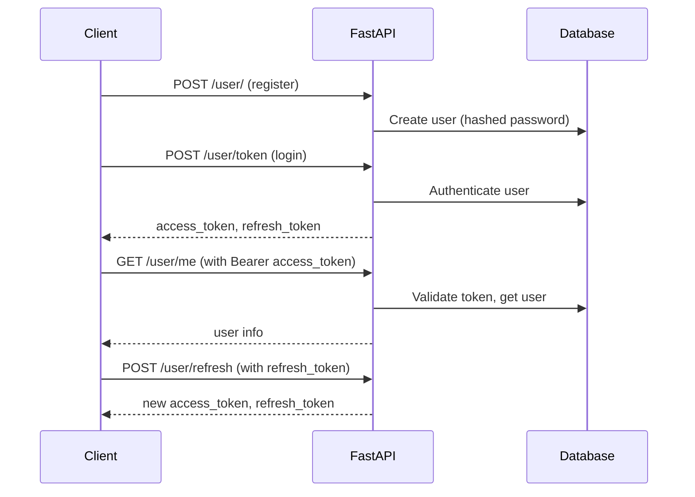

# 9. OAuth2 Authentication in FastAPI

## 🚀 Overview
This guide covers implementing OAuth2 authentication in FastAPI using JWTs, including both **access tokens** and **refresh tokens**. You'll learn:
- How OAuth2 works in FastAPI
- How to register users
- How to generate and use access/refresh tokens
- How to protect endpoints
- How to test with Swagger UI
- Full code with comments and explanations

---

## 🔐 What is OAuth2?
OAuth2 is a standard protocol for authorization. In FastAPI, the most common flow is **OAuth2 Password Flow** with JWTs (JSON Web Tokens). This lets users log in with a username and password, receive a token, and use that token to access protected endpoints.

---

## 🗂️ Project Structure (Relevant Files)
```
.
├── main.py
├── routers/
│   └── user.py
├── db/
│   ├── database.py
│   ├── models.py
│   ├── db_user.py
│   └── hash.py
├── auth/
│   └── oauth.py
├── schemas.py
└── Blogs/
    └── 9. OAuth.md
```

---

## 1️⃣ User Registration
Register users with hashed passwords.

**schemas.py**
```python
from pydantic import BaseModel

class UserBase(BaseModel):
    username: str
    email: str
    password: str

class UserDisplay(BaseModel):
    username: str
    email: str
    class Config:
        orm_mode = True  # For ORM compatibility
```

**db/models.py**
```python
from sqlalchemy.sql.sqltypes import Integer, String
from db.database import Base
from sqlalchemy import Column

class DbUser(Base):
    __tablename__ = 'users'
    id = Column(Integer, primary_key=True, index=True)
    username = Column(String)
    email = Column(String)
    password = Column(String)  # Hashed password
```

**db/hash.py**
```python
from passlib.context import CryptContext

pwd_cxt = CryptContext(schemes=['bcrypt'], deprecated='auto')

class Hash():
    @staticmethod
    def bcrypt(password: str):
        return pwd_cxt.hash(password)
    @staticmethod
    def verify(hashed_password, plain_password):
        return pwd_cxt.verify(plain_password, hashed_password)
```

**db/db_user.py**
```python
from sqlalchemy.orm import Session
from schemas import UserBase
from db.models import DbUser
from db.hash import Hash

def create_user(db: Session, request: UserBase):
    new_user = DbUser(
        username=request.username,
        email=request.email,
        password=Hash.bcrypt(request.password)
    )
    db.add(new_user)
    db.commit()
    db.refresh(new_user)
    return new_user
```

**routers/user.py**
```python
from fastapi import APIRouter, Depends
from sqlalchemy.orm import Session
from schemas import UserBase, UserDisplay
from db.database import get_db
from db import db_user

router = APIRouter(prefix="/user", tags=["user"])

@router.post("/", response_model=UserDisplay)
def create_user(request: UserBase, db: Session = Depends(get_db)):
    return db_user.create_user(db, request)
```

---

## 2️⃣ OAuth2 Token Generation (Access & Refresh)

**schemas.py**
```python
class Token(BaseModel):
    access_token: str
    token_type: str
    refresh_token: str

class TokenData(BaseModel):
    username: str | None = None
```

**auth/oauth.py**
```python
from fastapi.security import OAuth2PasswordBearer
from datetime import datetime, timedelta
from jose import JWTError, jwt
from fastapi import Depends, HTTPException, status
from sqlalchemy.orm import Session
from db.database import get_db
from db.models import DbUser
from db.hash import Hash
from schemas import TokenData

SECRET_KEY = "supersecretkey"  # Use env var in production
ALGORITHM = "HS256"
ACCESS_TOKEN_EXPIRE_MINUTES = 15
REFRESH_TOKEN_EXPIRE_MINUTES = 60 * 24 * 7  # 7 days

oauth2_schema = OAuth2PasswordBearer(tokenUrl='token')

def create_access_token(data: dict, expires_delta: timedelta | None = None):
    to_encode = data.copy()
    expire = datetime.utcnow() + (expires_delta or timedelta(minutes=ACCESS_TOKEN_EXPIRE_MINUTES))
    to_encode.update({"exp": expire})
    return jwt.encode(to_encode, SECRET_KEY, algorithm=ALGORITHM)

def create_refresh_token(data: dict):
    expire = datetime.utcnow() + timedelta(minutes=REFRESH_TOKEN_EXPIRE_MINUTES)
    to_encode = data.copy()
    to_encode.update({"exp": expire, "scope": "refresh_token"})
    return jwt.encode(to_encode, SECRET_KEY, algorithm=ALGORITHM)

def authenticate_user(db: Session, username: str, password: str):
    user = db.query(DbUser).filter(DbUser.username == username).first()
    if not user or not Hash.verify(user.password, password):
        return False
    return user

def get_current_user(token: str = Depends(oauth2_schema), db: Session = Depends(get_db)):
    credentials_exception = HTTPException(
        status_code=status.HTTP_401_UNAUTHORIZED,
        detail="Could not validate credentials",
        headers={"WWW-Authenticate": "Bearer"},
    )
    try:
        payload = jwt.decode(token, SECRET_KEY, algorithms=[ALGORITHM])
        username: str = payload.get("sub")
        if username is None:
            raise credentials_exception
        token_data = TokenData(username=username)
    except JWTError:
        raise credentials_exception
    user = db.query(DbUser).filter(DbUser.username == token_data.username).first()
    if user is None:
        raise credentials_exception
    return user
```

---

## 3️⃣ Login & Token Endpoints

**routers/user.py**
```python
from fastapi.security import OAuth2PasswordRequestForm
from fastapi import status, HTTPException, Depends
from auth.oauth import authenticate_user, create_access_token, create_refresh_token, get_current_user
from schemas import Token
from sqlalchemy.orm import Session
from db.database import get_db

@router.post("/token", response_model=Token)
def login_for_access_token(form_data: OAuth2PasswordRequestForm = Depends(), db: Session = Depends(get_db)):
    user = authenticate_user(db, form_data.username, form_data.password)
    if not user:
        raise HTTPException(
            status_code=status.HTTP_401_UNAUTHORIZED,
            detail="Incorrect username or password",
            headers={"WWW-Authenticate": "Bearer"},
        )
    access_token = create_access_token(data={"sub": user.username})
    refresh_token = create_refresh_token(data={"sub": user.username})
    return {"access_token": access_token, "token_type": "bearer", "refresh_token": refresh_token}

# Refresh token endpoint
@router.post("/refresh", response_model=Token)
def refresh_access_token(refresh_token: str, db: Session = Depends(get_db)):
    from jose import JWTError, jwt
    from auth.oauth import SECRET_KEY, ALGORITHM, create_access_token, create_refresh_token
    try:
        payload = jwt.decode(refresh_token, SECRET_KEY, algorithms=[ALGORITHM])
        if payload.get("scope") != "refresh_token":
            raise HTTPException(status_code=401, detail="Invalid scope for token")
        username: str = payload.get("sub")
        if username is None:
            raise HTTPException(status_code=401, detail="Invalid token payload")
    except JWTError:
        raise HTTPException(status_code=401, detail="Invalid refresh token")
    access_token = create_access_token(data={"sub": username})
    new_refresh_token = create_refresh_token(data={"sub": username})
    return {"access_token": access_token, "token_type": "bearer", "refresh_token": new_refresh_token}
```

---

## 4️⃣ Protecting Endpoints

**routers/user.py**
```python
@router.get("/me", response_model=UserDisplay)
def read_users_me(current_user: UserBase = Depends(get_current_user)):
    return current_user
```

---

## 5️⃣ Testing in Swagger UI

1. **Register a user**: `POST /user/` with JSON body.
2. **Get tokens**: `POST /user/token` with form data (username, password).
3. **Authorize**: Click **Authorize** in Swagger UI, paste the `access_token`.
4. **Access protected endpoint**: `GET /user/me`.
5. **Refresh token**: `POST /user/refresh` with the `refresh_token`.

---

## 🔄 Flow Diagram


---

## 📝 Comments & Explanations
- **Access Token**: Short-lived, used for API access.
- **Refresh Token**: Long-lived, used to get new access tokens without re-login.
- **JWT**: Encodes user info and expiry, signed with a secret.
- **Security**: Store secrets securely, use HTTPS in production.
- **Swagger UI**: Makes testing easy—register, login, authorize, and test protected endpoints.

---

## ✅ Summary Table
| Step                | Endpoint         | Method | Auth Required | Description                      |
|---------------------|-----------------|--------|---------------|----------------------------------|
| Register            | /user/           | POST   | No            | Create a new user                |
| Login (get tokens)  | /user/token      | POST   | No            | Get access & refresh tokens      |
| Refresh token       | /user/refresh    | POST   | No            | Get new tokens with refresh      |
| Protected endpoint  | /user/me         | GET    | Yes           | Get current user info            |

---

## 🧠 Best Practices
- Never store plain passwords.
- Use short expiry for access tokens.
- Use refresh tokens for long sessions.
- Secure your secret key and use environment variables.
- Use HTTPS in production.

---

## 🎓 References
- [FastAPI Security Docs](https://fastapi.tiangolo.com/tutorial/security/oauth2-jwt/)
- [OAuth2 RFC](https://datatracker.ietf.org/doc/html/rfc6749)
- [JWT.io](https://jwt.io/)
---
 

# 🔐 FastAPI Authentication – OAuth2 with Password Flow (JWT Based)

---

## 🧩 Why Authentication?

Authentication verifies **"who you are"** 🧑‍💻.

It’s needed for:

* 🔐 Protecting routes
* 📦 Handling user identity
* 🛡️ Role-based access control

---

## 🔑 OAuth2 + Password Flow (with JWT)

### What is it?

A simplified **login system** using:

1. **Username + Password** from user
2. Return a **JWT token**
3. Client stores it (usually in localStorage / cookies)
4. Uses token for all **future requests**

---

## 🧭 Authentication Flow (Step-by-step):

### ✅ Flow Summary

```
[1] User → POST /login  (username, password)
      |
[2] Backend verifies credentials
      |
[3] If valid → returns JWT token (access_token)
      |
[4] User stores token and sends it in Authorization header
      |
[5] For protected routes → backend checks token validity
      |
[6] If token is valid → access granted
```

---

## 🧑‍💻 Code Implementation: Full Working Flow

### 1️⃣ Install required packages

```bash
pip install fastapi uvicorn python-jose[cryptography] passlib[bcrypt]
```

---

### 2️⃣ Basic Setup

```python
from fastapi import FastAPI, Depends, HTTPException, status
from fastapi.security import OAuth2PasswordBearer, OAuth2PasswordRequestForm
from jose import JWTError, jwt
from passlib.context import CryptContext
from datetime import datetime, timedelta

app = FastAPI()
```

---

### 3️⃣ Secrets and Constants 🔐

```python
# 👇 Used to sign JWT token
SECRET_KEY = "your-secret-key"
ALGORITHM = "HS256"
ACCESS_TOKEN_EXPIRE_MINUTES = 30
```

---

### 4️⃣ Password Hashing 🔑

```python
pwd_context = CryptContext(schemes=["bcrypt"], deprecated="auto")

def verify_password(plain_pwd, hashed_pwd):
    return pwd_context.verify(plain_pwd, hashed_pwd)

def hash_password(password):
    return pwd_context.hash(password)
```

---

### 5️⃣ Dummy User DB

```python
fake_user_db = {
    "johndoe": {
        "username": "johndoe",
        "hashed_password": hash_password("secret123"),
    }
}
```

---

### 6️⃣ Authenticate User Function

```python
def authenticate_user(username: str, password: str):
    user = fake_user_db.get(username)
    if not user or not verify_password(password, user["hashed_password"]):
        return False
    return user
```

---

### 7️⃣ JWT Token Creator 🎟️

```python
def create_access_token(data: dict, expires_delta: timedelta = None):
    to_encode = data.copy()
    expire = datetime.utcnow() + (expires_delta or timedelta(minutes=15))
    to_encode.update({"exp": expire})
    return jwt.encode(to_encode, SECRET_KEY, algorithm=ALGORITHM)
```

---

### 8️⃣ OAuth2 Token Route (`/token`)

```python
oauth2_scheme = OAuth2PasswordBearer(tokenUrl="token")

@app.post("/token")
def login(form_data: OAuth2PasswordRequestForm = Depends()):
    user = authenticate_user(form_data.username, form_data.password)
    if not user:
        raise HTTPException(status_code=401, detail="Invalid credentials")

    access_token = create_access_token(data={"sub": user["username"]})
    return {"access_token": access_token, "token_type": "bearer"}
```

🧠 Note: `OAuth2PasswordRequestForm` expects:

```x-www-form-urlencoded:
  username=...&password=...
```

---

### 9️⃣ Protected Route Example

```python
from jose import JWTError, jwt
from fastapi import Security

def get_current_user(token: str = Depends(oauth2_scheme)):
    try:
        payload = jwt.decode(token, SECRET_KEY, algorithms=[ALGORITHM])
        username: str = payload.get("sub")
        if username is None:
            raise HTTPException(status_code=401, detail="Token invalid")
        return fake_user_db.get(username)
    except JWTError:
        raise HTTPException(status_code=401, detail="Token invalid")

@app.get("/me")
def read_current_user(current_user: dict = Depends(get_current_user)):
    return current_user
```

---

## 🧪 Testing the Flow (Postman or curl)

### 1. 🔐 Login — Get Token

```bash
POST /token
Content-Type: application/x-www-form-urlencoded

username=johndoe&password=secret123
```

💡 Response:

```json
{
  "access_token": "eyJhbGciOiJIUzI1NiIsInR5cCI6...",
  "token_type": "bearer"
}
```

---

### 2. ✅ Access Protected Route

```http
GET /me
Authorization: Bearer <access_token>
```

---

## 🧠 Summary Diagram

```
CLIENT (React/Frontend)
  ↓
[POST] /token  ← login form (username, password)
  ↓
Returns JWT Token
  ↓
Stores token → uses it in header for future requests

[GET] /me
Authorization: Bearer <token>

→ Server decodes token
→ Checks expiry + user
→ Returns secured data
```

---

## 🎓 Final Notes

| Concept               | Description                           |
| --------------------- | ------------------------------------- |
| JWT                   | Encoded token containing user info    |
| OAuth2PasswordForm    | Built-in FastAPI dependency for login |
| `Depends()`           | Injects dependencies automatically    |
| `Bearer Token`        | Standard in `Authorization` header    |
| `@app.post("/token")` | Auth route                            |
| `/me`                 | Protected route with user info        |

---


# 🔐 FastAPI Advanced Authentication – Access & Refresh Tokens + Role-based Auth

---

## 🌐 What Are Access & Refresh Tokens?

| Token Type    | Lifespan    | Use Case                          |
| ------------- | ----------- | --------------------------------- |
| Access Token  | Short (15m) | Used for accessing protected APIs |
| Refresh Token | Long (7d+)  | Used to get a new access token 🔄 |

---

## 🧭 Full Auth Flow (Dual Token Logic)

```plaintext
[1] User sends username + password → /login
      |
[2] Server returns:
     - access_token (15 min)
     - refresh_token (7 days)
      |
[3] Client stores both tokens (e.g., localStorage/cookies)
      |
[4] Use access_token in Authorization header
      |
[5] If access_token expires:
      - Send refresh_token → /refresh
      - Get new access_token
```

---

## ✅ 1. Setup Constants & Secrets

```python
SECRET_KEY = "super-secret-key"
REFRESH_SECRET_KEY = "super-refresh-secret"
ALGORITHM = "HS256"

ACCESS_TOKEN_EXPIRE_MINUTES = 15
REFRESH_TOKEN_EXPIRE_DAYS = 7
```

---

## 🔐 2. Token Creation Functions

```python
from datetime import datetime, timedelta
from jose import jwt

def create_access_token(data: dict):
    expire = datetime.utcnow() + timedelta(minutes=ACCESS_TOKEN_EXPIRE_MINUTES)
    to_encode = {**data, "exp": expire}
    return jwt.encode(to_encode, SECRET_KEY, algorithm=ALGORITHM)

def create_refresh_token(data: dict):
    expire = datetime.utcnow() + timedelta(days=REFRESH_TOKEN_EXPIRE_DAYS)
    to_encode = {**data, "exp": expire}
    return jwt.encode(to_encode, REFRESH_SECRET_KEY, algorithm=ALGORITHM)
```

---

## 🔐 3. `/login` Endpoint → Generate Dual Tokens

```python
@app.post("/login")
def login(form_data: OAuth2PasswordRequestForm = Depends()):
    user = authenticate_user(form_data.username, form_data.password)
    if not user:
        raise HTTPException(status_code=401, detail="Invalid credentials")

    user_data = {"sub": user["username"], "role": user.get("role", "user")}
    access_token = create_access_token(user_data)
    refresh_token = create_refresh_token(user_data)

    return {
        "access_token": access_token,
        "refresh_token": refresh_token,
        "token_type": "bearer"
    }
```

---

## 🔁 4. `/refresh` Endpoint

```python
@app.post("/refresh")
def refresh_token(refresh_token: str = Form(...)):
    try:
        payload = jwt.decode(refresh_token, REFRESH_SECRET_KEY, algorithms=[ALGORITHM])
        username = payload.get("sub")
        role = payload.get("role")
    except JWTError:
        raise HTTPException(status_code=403, detail="Invalid refresh token")

    new_access_token = create_access_token({"sub": username, "role": role})
    return {"access_token": new_access_token, "token_type": "bearer"}
```

---

## 🚪 5. Logout (Token Blacklist Optional)

JWT is **stateless**, so logout = remove token client-side.

But for extra security 🔐 you can:

* Maintain a **blacklist of tokens**
* Invalidate tokens manually

Example:

```python
blacklisted_tokens = set()

@app.post("/logout")
def logout(token: str = Depends(oauth2_scheme)):
    blacklisted_tokens.add(token)
    return {"msg": "Logged out successfully"}
```

Check if token is blacklisted before allowing access.

---

## 🧩 6. Role-Based Access Control

Add role into JWT, then restrict route access:

```python
def get_current_user(token: str = Depends(oauth2_scheme)):
    try:
        payload = jwt.decode(token, SECRET_KEY, algorithms=[ALGORITHM])
        username = payload.get("sub")
        role = payload.get("role")
    except JWTError:
        raise HTTPException(status_code=401, detail="Invalid token")

    return {"username": username, "role": role}
```

### 🧑‍💼 Restrict route to `admin` only:

```python
@app.get("/admin")
def read_admin_data(user: dict = Depends(get_current_user)):
    if user["role"] != "admin":
        raise HTTPException(status_code=403, detail="Admins only 🛑")
    return {"msg": "Welcome, admin!"}
```

---

## 🧠 Visual Flowchart

```plaintext
[ Client UI ]
   ↓
POST /login
(username, password)
   ↓
[ Server ]
✔ Validate credentials
✔ Generate:
   - access_token (15 min)
   - refresh_token (7d)
   ↓
Client stores tokens
⇣
------ API CALLS (Protected) ------
GET /profile
Authorization: Bearer access_token
⇣
[ Server ]
✔ Decode access_token → Allow access
🧠 If token expired → use refresh

--- Refresh Flow ---
POST /refresh
(refresh_token)
  ↓
✔ Decode → Issue new access_token
```

---

## 💡 Example Token Payload

```json
{
  "sub": "johndoe",
  "role": "admin",
  "exp": 1724352812
}
```

---

## 🔑 Summary Table

| Feature                | Endpoint        | Token Used         | Notes                               |
| ---------------------- | --------------- | ------------------ | ----------------------------------- |
| Login                  | `/login`        | -                  | Returns access + refresh tokens     |
| Access Protected Route | `/me`, `/admin` | `access_token`     | Must send in `Authorization` header |
| Refresh Token          | `/refresh`      | `refresh_token`    | Returns new `access_token`          |
| Logout                 | `/logout`       | access\_token      | Add to blacklist (optional)         |
| Role Protection        | any route       | with `role` in JWT | Check `user["role"]` in logic       |

---

